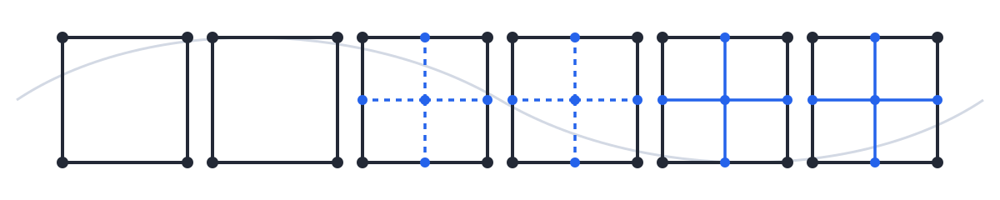
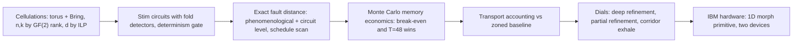
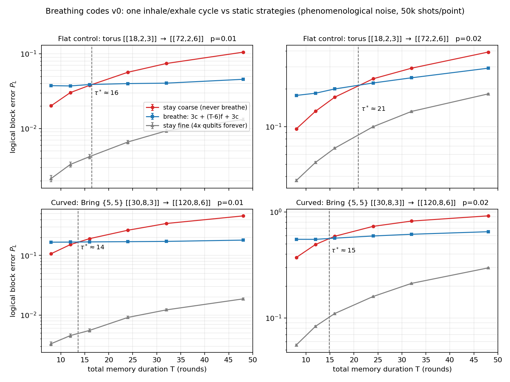
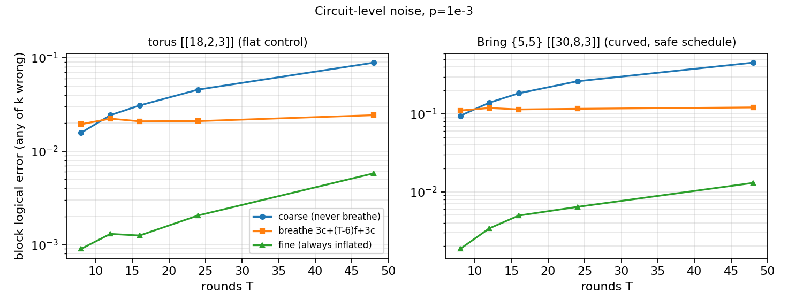
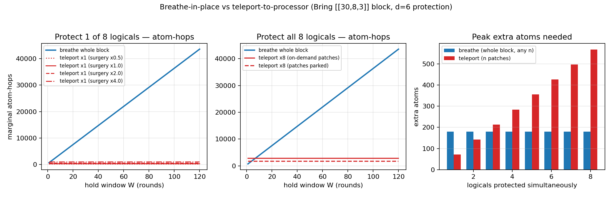
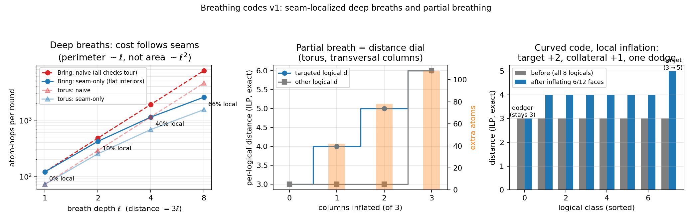
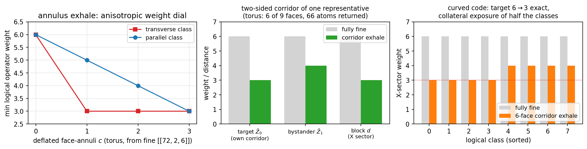

<div align="center">

<picture>
  <source media="(prefers-color-scheme: dark)" srcset="docs/assets/banner-dark.svg">
  
</picture>

# Breathing codes

**Quantum LDPC memories that morph their curvature at runtime**

[](#citing-this-work)
[](https://kansari123.github.io/Breathing-codes-quantum-LDPC-memories/)
[](#reproducing-the-results)
[](code/requirements.txt)
[](code/requirements.txt)

</div>

**One code block whose curvature is a runtime variable: coarse and curved to store densely, fine and flat to protect, morphed fault-tolerantly on demand.**

## The approach

Hyperbolic quantum LDPC codes store many logical qubits per physical qubit, at low distance. Fine-graining the tiling flattens it and buys distance, at quadratic qubit cost. Every existing construction fixes that trade at design time. A breathing code makes it a schedule: the block sits in a dense curved phase to store, inhales (quad refinement, borrowed qubits from a reservoir) into a flatter high-distance phase for a compute window or a noise burst, then exhales the qubits back. Both directions are code deformation with one deterministic fold detector per refined face, so decoding runs through the morph without interruption. The number of logical qubits is pinned by topology the whole time.

The study covers a flat control (toric, [[18,2,3]] to [[72,2,6]]) and the hyperbolic {5,5} Bring code ([[30,8,3]] to [[120,8,6]]), analyzed phenomenologically and at circuit level with explicit CNOT extraction, plus a two-device IBM hardware run of the one-dimensional morph primitive.

> [!IMPORTANT]
> Circuit-level finding with a design rule attached: the fault distance of the full morph cycle is schedule dependent on the curved code. Hook faults can cut it from 3 to 2 mid-morph in 5 of 8 schedules whose static phases are individually good. Morph-safe schedules exist (3 of 8) and certifying one is an exact computation taking seconds. Gate schedules must therefore be certified jointly across coarse, fine, and morph phases; per-phase quality does not imply morph-cycle quality.

## Advantage over classical error correction

Classical redundancy cannot store a qubit at all: unknown quantum states cannot be copied, so protecting them requires quantum error correction, and the density that makes classical memories cheap has to be re-earned inside a quantum code. Hyperbolic codes are how that density is imported into the quantum setting, and their price is fixed low distance. Breathing removes the "fixed": the density of a hyperbolic memory, with distance purchasable at runtime exactly when it is needed. The classical control overhead this adds is small and front-loaded: the schedule certification above is a compile-time check, and the fold detectors are ordinary parity data for the existing decoder.

## Advantage over other quantum methods

Two existing answers to the storage/protection tension, and where breathing differs:

Static code families, including the semi-hyperbolic dial of Breuckmann and Terhal, expose curvature as a design knob but set it at fabrication. Runtime distance change exists only for flat codes (Q3DE patch growth, Surf-Deformer, Floquet schedules). Breathing is the runtime version of the curvature dial itself, and it is the only scheme in this comparison that changes protection in place, with no second code and no teleportation circuits.

The zoned neutral-atom architecture holds two fixed codes and teleports logicals between them. Measured against it under a stated transport model, breathing loses the hop budget for long single-logical holds but protects the whole block with 180 extra atoms versus 568, a 3.2x smaller peak footprint, and offers two capabilities the zoned design lacks: graded per-logical distance (inflate c transversal columns, targeted distance rises to d+c, exactly) and in-place operation discounts (exhale one operator corridor, the targeted logical's minimum operator weight drops from ℓd back to d, 6 to 3 here, ILP-exact and guaranteed by a min-max duality).

| Capability | Static coarse | Static fine | Zoned teleport | Breathing |
|---|---|---|---|---|
| Storage density | high | low (4x qubits) | high in storage zone | high while exhaled |
| Distance on demand | no | always paid | via teleport to patch | yes, in place |
| Peak extra atoms, whole-block d=6 (Bring) | none | permanent 4x | 568 | 180 |
| Long single-logical hold | weak | costly | best transport cost | loses hop budget |
| Per-logical graded distance | no | no | no | yes, d to d+c |
| In-place operator-weight discount | no | no | no | yes, 6 to 3 exact |
| Measured hardware break-even | n/a | n/a | n/a | at most 8 rounds (1D primitive) |

## Results pipeline



## Figure gallery

| | |
|---|---|
|  | **Memory economics, phenomenological.** One cycle has a fixed overhead, then near-free holding at d=6. Break-even 14-20 rounds at p=1-2%; at T=48 the cycle cuts block error 2.3x (torus) and 2.5x (Bring). |
|  | **Circuit level, p=0.001.** The structure survives explicit CNOT extraction and strengthens: break-even about 10 rounds, T=48 wins 3.7x (torus) and 3.8x (Bring). |
|  | **Versus the zoned baseline.** Teleport wins the hop budget; breathing protects the whole block with 180 extra atoms versus 568, a 3.2x footprint advantage. |
|  | **Two dials.** Deep refinement concentrates transport on tile seams (66.5% of checks transport-free at depth 8, perimeter not area scaling). Partial refinement raises a targeted logical's distance to d+c per inflated column. |
|  | **Exhale to operate.** Deflating one operator corridor restores coarse operator weight for the targeted logical (6 to 3, ILP-exact), guaranteed by a min-max duality, with collateral exposure as its price on curved codes. |

## Reproducing the results

```bash
pip install -r code/requirements.txt
cd code
bash run_all.sh              # v0 + v1: all simulation results, ~10-15 min on a laptop
python3 run_circuit_level.py # circuit-level study, ~3-5 min on a laptop
```

Both pipelines were re-run end to end from this tree on 2026-07-26 (2.6 min and 1.8 min respectively on a container; every step exits cleanly). Exact quantities (code parameters, fault distances, transport counts, ILP distances) reproduce identically. Monte Carlo quantities reproduce within their stated statistical errors; stim's seeded streams are not bit-portable across machines, so exact bit-match to the archived JSONs in `data/` is not expected. All numbers quoted in the paper match the archived JSONs.

The hardware experiment ships as a self-contained notebook in `hardware/` with pre-registered acceptance thresholds, a noiseless determinism gate and a fake-backend compile gate that run before any submission, and raw detector archives for zero-cost reanalysis.

## Repository layout

```
code/       nine analysis modules + run_all.sh + run_circuit_level.py
data/       archived result JSONs (the numbers quoted in the paper)
figures/    all generated figures
hardware/   IBM notebook (clean + executed) and helper module
docs/       project landing page (GitHub Pages)
HANDOFF.md  full project record: context, results, roadmap
RESULTS.md  condensed results tables
CIRCUIT_LEVEL.md  the circuit-level study, self-contained
```

## Citing this work

arXiv identifier pending; the entry below will be updated when it is assigned.

```bibtex
@misc{ansari2026breathing,
  title  = {Breathing codes: quantum LDPC memories that morph their curvature at runtime},
  author = {Ansari, Kamran},
  year   = {2026},
  note   = {arXiv identifier pending}
}
```

## License and contact

No license file yet; until one is added, default copyright terms apply.

Contact: [ansarik@stanford.edu](mailto:ansarik@stanford.edu)
